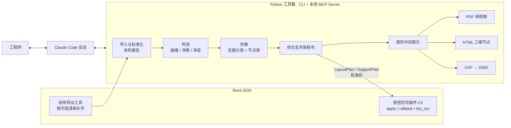

# 轻量化管综排布工具 · 技术基线 v3

2026-09-28 · @Ethon Hunt

本版在 v2（[baseline-v2.md](baseline-v2.md)）基础上，按评审意见和确认结果修订，**以本文档为准**。《R0 任务书》《数据协议》《工程口径与规则》是给开发代理的执行依据，将在拿到现有导出工具源码和样例模型后，按本文档编写。

## 0. v2 → v3 修订要点

| 项 | v2 | v3 |
| --- | --- | --- |
| 工具箱语言 | TypeScript | **Python**（求解用 OR-Tools CP-SAT，DXF 用 ezdxf）；Revit 侧 C# |
| 节点 | 仅作为“段间翻弯代价” | **R1 纳入节点类型库**，节点作为两端给定的局部三维问题求解 |
| 三维审阅 | R4 可选 HTML 查看器 | **R1 纳入只读 HTML 查看器**，用于节点审阅 |
| 出图 | PDF，DWG 另行决定 | **PDF（审核）+ DXF→DWG（交付）**，同一套图形中间表示 |
| 综合支吊架 | 含选型验算 | **排布与表达为主**，规格按图纸或设计要求、图集查表；验算改为可选追加；抗震只预留位置 |
| Revit MCP | 在现有 MCP 上加命令 | **重新搭建**受控插件（Revit 2020），不开放任意代码执行 |
| 人工干预 | 未明确 | 排布全自动，不留人工修改接口；需要修改时在回写后于 Revit 中改 |
| 数据安全 | “数据留在本机” | 项目不涉密；改为“无自建中转、无 API 集成”（见 2.5） |
| 净高口径 | 含保温外轮廓 | 含保温外轮廓，且**计至支吊架横担底** |
| 研究产出 | 无 | 新增第 12 节，开发过程同步记录评估数据 |

## 1. 产品定位

Claude 驱动的管综深化工作台，团队自用。流程：

Revit → 导出 → Claude 调用确定性工具完成排布、节点、综合支吊架与出图 → 工程师审 PDF / HTML → 批准 → 回写 Revit → 出 DWG。

成果：管综方案、节点方案、综合支吊架排布、PDF 审核图与报告、三维节点 HTML、DWG 图纸、Revit 实模更新。

## 2. 分工原则

1. **Claude 是执行核心**：理解要求、写约束文件、调用工具、比较方案、解释诊断、写报告叙述。
2. **硬数值只来自确定性工具**：坐标、碰撞、净距、净高、支吊架位置与规格、图纸几何均由程序计算。落实为三条规则：
   - 约束文件经 schema 校验并回显确认，每条保留工程师原话；
   - 报告、PDF、HTML 中的数值一律由模板从工具输出填充；
   - Claude 撰写的叙述只引用结果编号，不写入计算得到的数值。
3. **工程师是审核者**：提要求、看 PDF 与 HTML、批准；批准后才回写。
4. **可复现的边界**：Claude 的对话过程不要求可复现；“输入数据 + 约束文件 + 规则集版本 + 工具版本 + 随机种子 → 结果”必须可复现，工具离开 Claude 可在命令行独立运行。会话记录随方案归档，供追溯。
5. **数据边界**：项目不涉密。不做 Claude API 集成、不建中转服务；源数据与成果文件留在本机，工具输出会进入 Claude Code 会话。为控制上下文规模，MCP 工具默认返回摘要与编号，完整几何写入本地文件。
6. **Revit 是正式模型层**，只在批准后回写。

## 3. 目标架构

- 工具箱：Python 包，每个功能既是 CLI 子命令，也作为 MCP 工具暴露给 Claude Code。
- Revit 侧：导出沿用现有工具（源码将上传，按需调整）；回写新建受控插件，参考开源 revit-mcp 的插件骨架与通信方式，只保留受控命令。
- 不做浏览器编辑器；HTML 查看器只读。

## 4. 技术栈

| 用途 | 选型 | 说明 |
| --- | --- | --- |
| 语言与环境 | Python 3.11+，uv 管理依赖，pytest | 工具箱需在 Windows（Revit 机器）与 Linux（开发代理）上都能运行 |
| 数据模型与校验 | pydantic | 导出数据、约束文件、LayoutPlan、SupportPlan 均有 schema 与版本号 |
| 几何 | numpy、shapely；三维碰撞用包围盒 + 精确检测 | 管线按圆柱 / 长方体外轮廓（含保温） |
| 求解 | OR-Tools CP-SAT；段链用动态规划 | 分层、层内排序、节点组合均为约束优化 |
| PDF | reportlab（嵌入中文 TTF 字体） | 字体须确认授权 |
| DXF / DWG | ezdxf 生成 DXF；ODA File Converter 批量转 DWG | 图层、线型、字体按团队标准配置 |
| 三维查看器 | three.js，单文件 HTML，内联脚本与数据 | 离线可打开 |
| MCP | 官方 Python MCP SDK | stdio 方式接入 Claude Code |
| Revit 插件 | C#，.NET Framework 4.8，Revit 2020 API | 参考 RevitMCPSDK / mcp-servers-for-revit 的骨架，去掉任意代码执行 |

## 5. 数据与口径要点（R0）

- **坐标与单位**：导出时记录 Revit 内部坐标（英尺）到项目坐标（毫米）的变换、项目基点、测量点和链接模型变换；工具内部统一为毫米和项目坐标。
- **构件标识**：使用 UniqueId；基线哈希按构件粒度记录，供回写前 expect 校验。
- **拓扑**：导出管道、风管、桥架、线管及其管件、附件的连接关系（connector）。移动和翻弯需要带动管件与支管。
- **构件范围**：
  - 机电：管道、风管、桥架、线管、管件、阀门与附件（含检修空间）、保温层；
  - 土建：梁、板、柱、墙、吊顶（含标高）；
  - 末端：喷头、灯具、风口、检修口；
  - 出图底图：轴网、标高、房间。
- **净高口径**：以含保温外轮廓计算，净高计至管线底与支吊架横担底中的较低者。R1 分层时即按层预留横担高度。
- **体检报告**：系统映射缺失、保温缺失、未连接端口、坐标异常、重复构件等逐项列出；系统映射由 Claude 提建议、人工确认。

## 6. 排布求解（R1）

### 6.1 允许的改动类型

| 类型 | 默认 | 说明 |
| --- | --- | --- |
| 平移（横向、竖向） | 允许 | 连接的管件、支管随之调整 |
| 翻弯 | 允许 | 可选角度按规则集（如 45°、90°） |
| 改截面（风管改扁、管径变化） | 不允许 | 仅当设计明确允许，逐条写入约束文件 |
| 重力管、坡度管 | 仅保持坡度整体平移 | 不向上翻弯 |
| 锁定构件 | 不动 | 已施工、设计指定、大风管、消防主管等，由约束文件标记 |

排布全自动，不提供人工修改接口；工程师的意见通过约束文件进入下一轮求解，或在回写后于 Revit 中直接修改。

### 6.2 规则集

默认规则集采用管综基本原则，**由项目标准覆盖**：

- 小管让大管、有压让无压、可弯让不易弯、支管让主管、附件少的让附件多的；
- 电上水下：桥架位于水管上方，或避免位于水管正下方；
- 系统间净距矩阵（含保温外壁）、阀门操作空间、检修通道宽度、桥架上方放线空间；
- 每条规则记录来源（规范条文或项目标准条款）和规则集版本号，区分硬约束与软偏好。

### 6.3 走廊求解

- 走廊由工具从模型自动提出候选（按管线主方向与墙体边界），Claude 确认后使用；Pilot 阶段由 Claude 在上传模型中选取。
- 沿走廊按事件切分区段：梁高变化、变径、支管引出、宽度变化。
- 每段用 CP-SAT 求分层方案：每根管线所在的层、层内顺序、横向位置；同层外底平齐（重力管除外），层间预留横担高度；出线方向约束，需要拐出的管线排在该侧或上层。
- 段间用动态规划选“各段代价 + 段间过渡代价”最小的组合。
- 层就是综合支吊架的横担，R2 直接沿用。

### 6.4 节点类型库

节点以相邻走廊段的截面方案为**边界条件**，在节点包络范围内做局部三维求解：枚举每根管线的过渡模式（直通、上翻、下翻、平绕，以及翻弯角度），由 CP-SAT 选出无碰撞、满足净距且代价最小的组合。

| 编号 | 节点类型 | 阶段 |
| --- | --- | --- |
| N1 | 交叉翻弯：两股管线或两条走廊相交 | R1 |
| N2 | 侧向引出：支管拐出走廊 | R1 |
| N3 | 翻梁：梁下空间不足时局部翻越 | R1 |
| N4 | 进出竖井、机房 | R4 |

无法求解的节点标记为“交人工”，报告中说明原因（冲突约束集）；标记本身也属于成果。

### 6.5 三个方案与目标量化

硬约束（无碰撞、满足净距与净高下限）之外，三个方案按字典序排列不同的主目标：

| 方案 | 主目标 | 次目标 |
| --- | --- | --- |
| 净高最优 | 最大化区段最小净高 | 改动最少 → 支吊架最省 |
| 改动最少 | 新增翻弯数 → 移动构件数 → 总位移量 | 净高 → 支吊架最省 |
| 支吊架最省 | 层数 → 横担总长 → 估算吊点数 | 净高 → 改动最少 |

无解时输出冲突约束集，由 Claude 向工程师解释并建议放松哪条。每个方案记录约束文件、规则集版本、工具版本和随机种子。

### 6.6 约束文件

工程师口述要求，Claude 写成约束文件（YAML）：硬约束与软偏好分开，每条带作用范围、数值、单位和原话；经 schema 校验与回显确认后才调用求解器；约束文件随方案归档。

## 7. 综合支吊架（R2）

定位为**排布与表达**，受力验算不是本团队的工作范围，作为可选追加。

- **布点**：沿走廊按该横担所承管线的最大间距取最严值（间距来自图纸、设计要求或图集）；避开管件、阀门检修位和洞口；支管引出、翻弯、变径两侧加设；生根于板底或梁侧。
- **型式**：门型、单侧悬臂、倒 L 型；多层时同一吊杆上多道横担。
- **规格**：横担型钢与吊杆规格按图纸、设计要求或图集查表确定；查表数据以团队提供的目录文件为准。
- **共架规则**：按项目具体要求配置，哪些系统允许共架、哪些必须独立设架。
- **抗震**：不做抗震设计；布点时为斜撑预留位置和空间，并在报告中列出预留点位。
- **可选验算（追加项）**：横担弯矩与挠度、吊杆拉力的简化验算，仅作参考，不出正式计算书。
- **输出**：SupportPlan（编号、位置、型式、横担长度与规格、吊杆规格、生根方式、所承管线）、支吊架表（PDF 与 xlsx）、剖面与平面表达、R3 族放置数据。

## 8. 出图

| 成果 | 格式 | 用途 |
| --- | --- | --- |
| 剖面图、平面图、冲突报告、支吊架表 | PDF | 审核介质 |
| 三维节点 | HTML（单文件，只读） | 审核节点翻弯与交叉 |
| 剖面图、平面图、支吊架详图 | DXF → DWG | 交付 |

- PDF 与 DXF 由同一套图形中间表示输出，内容一致。
- 需确定：图框、比例、标注样式、各系统图层 / 线型 / 颜色、字体、剖面位置选取规则。先出样张，工程师确认后再批量出。
- HTML 查看器支持旋转、剖切、按系统显隐、点选构件查看编号与属性；数值来自工具输出。

## 9. Revit 侧（R0 导出、R3 回写）

- **版本**：Revit 2020（.NET Framework 4.8）。
- **导出**：沿用现有导出工具，源码上传后按第 5 节字段清单调整。
- **回写插件**：新建受控插件，命令为 `apply_layout_plan`、`apply_support_plan`、`rollback_plan`、`read_elements`（抽查）。必须支持：
  - dry_run，以及逐项 expect 前置校验（基线哈希）；
  - 工作共享下的构件借用与 Pinned 处理，逐项报告；
  - TransactionGroup 包裹，幂等，partial_success 明细。
- **平移**：连同管件整体移动，并校验连接关系。
- **翻弯**：按布管系统配置生成弯头并重连。这是 R3 最大的技术风险，R1 期间即用一个真实节点先做试验。
- **支吊架族**：采用参数化族（横担长度、吊杆长度、层数可驱动），宿主方式优先无宿主或基于面，先用一个族试放置。
- **闭环**：回写后重新导出，再跑一遍检测，确认结果与方案一致。

## 10. 路线

| 阶段 | 交付 | 工程师得到什么 |
| --- | --- | --- |
| R0 数据与检测 | 导出适配、标准化、体检报告、检测、区段包络剖面、PDF 报告，CLI + MCP | 一段走廊的冲突、净距、净高全部列在 PDF 剖面上，结果与 Navisworks 逐条对照 |
| R1 排布与节点 | 走廊分层求解、节点库 N1–N3、约束文件、三方案、LayoutPlan、方案 PDF、节点 HTML；翻弯回写试验 | 口述要求，Claude 给出三个可审的方案，节点可三维查看 |
| R2 综合支吊架 | 布点、型式、规格查表、共架规则、抗震预留、支吊架表、剖面与平面表达、DXF / DWG | 带综合支吊架的完整深化成果与 DWG |
| R3 回写 Revit | 受控插件、管线移动与翻弯、支吊架族放置、前置校验、回滚、回写后复检 | 批准后实模自动更新 |
| R4 整层扩展 | 走廊与节点组成的图求解、N4 节点、自动分区、增量检测 | 整层批量处理 |

## 11. Pilot 两级验收

- **选段**：由 Claude 在上传模型中选取，选段标准：管线 ≥ 10 根、系统 ≥ 4 类、至少一处梁高变化、至少包含 N1–N3 中的两类节点。
- **对比基线**：优先使用同一区域的“排布前原始模型”与“人工排布完成模型”成对数据；人工排布耗时按记录或估算给出。

| 验收项 | Pilot-1（R1 后） | Pilot-2（R2 后） |
| --- | --- | --- |
| 时间目标 | 导出到三方案 PDF + 节点 HTML，耗时低于人工排布 | 方案确认到支吊架图纸，耗时低于人工 |
| 结果要求 | 无硬碰撞，满足净距、净高；至少采纳一个方案 | 布点、型式、规格被采纳，允许小幅修改 |
| 检测可信度 | 与 Navisworks / Revit 碰撞检查逐条对照，差异都能解释（容差、保温口径一致） | 规格与图集查表结果一致 |
| 节点 | N1–N3 自动求解率与“交人工”比例如实报告 | — |
| 评分 | 工程师按 1–5 分打分：碰撞、规范、规整美观、可施工性、改动量；平均 ≥ 3.5 且无单项 1 分 | 同左，加支吊架数量与型钢用量 |

## 12. 研究产出与数据记录

项目的方法与实测数据可形成论文。为此从 R0 起同步记录以下数据，不额外增加开发工作：

- 每次运行的输入规模、耗时、求解状态、各目标值；
- 方案评分、采纳情况；
- **回写后人工修改量**：回写后再次导出，与方案对比，得到构件级修改率。这是衡量自动排布可用性最直接的指标；
- 约束文件与工程师原话的对应及回显修正次数；
- Navisworks 对照差异及原因；
- 节点自动求解率与失败原因分类。

评估数据集（原始模型、人工排布模型、评分记录）按项目脱敏后归档在 `eval/` 目录，结构在 R0 任务书中定义。

## 13. 不做清单

- Claude API 集成、中转服务、多用户 Web 产品、账户与权限
- 浏览器编辑器、人工修改排布的交互界面
- 支吊架受力的正式计算书、抗震支吊架设计
- CDE、BIM 云平台、多人协作、IFC Authoring、通用 IFC 导入、Revit 替代
- 全建筑自动路由、任意代码执行、Revit 实时双向同步

## 14. 风险总表

| 风险 | 阶段 | 应对 |
| --- | --- | --- |
| 导出工具字段不足或格式不稳 | R0 | 源码已可调整；先对照字段清单补齐，导入即出体检报告 |
| 模型质量（系统乱挂、保温缺失、未连接） | R0 | 体检报告；映射由 Claude 建议、人工确认 |
| 口径不统一 | R0 | 写入《工程口径与规则》，净高计至横担底 |
| 单切面漏梁、坡度管、链接坐标 | R0 | 包络剖面、标高范围、manifest 记录变换 |
| 规则集写不全，方案“不像人排的” | R1 | 项目标准逐条入规则集；以人工排布模型作金标准回归测试 |
| 节点组合爆炸或无解 | R1 | 限定过渡模式枚举；超时或无解标记“交人工” |
| Claude 转录错误 | R1 | 约束 schema 校验 + 回显；报告数值由模板填充 |
| 翻弯回写不稳定（Revit 2020 管件生成与重连） | R1 试验、R3 | R1 即做单节点试验；失败项 partial_success 报告，交人工 |
| 图面不符合习惯 | R1、R2 | 先定图框、图层、标注样张，确认后批量 |
| 开发代理无法运行 Revit | 全程 | 逻辑全在 Python 侧自动测试；Revit 侧由工程师运行并回传日志 |
| 导出后模型继续变更 | R3 | 基线哈希 + expect 前置校验 |
| 整层规模 | R4 | 分区、图求解、增量检测 |
| 工程责任 | 全程 | 方案状态流转（草稿 → 待审 → 批准 → 已回写 / 作废）记录确认人与时间 |

## 15. 待提供与待确认

| # | 事项 | 需要时点 |
| --- | --- | --- |
| 1 | 现有导出工具源码与样例导出文件 | R0 开始 |
| 2 | 样例模型；如有，同一区域的排布前 / 排布后成对模型 | R0 开始 |
| 3 | 项目管综标准（净距、排布原则、净高要求） | R0 |
| 4 | 图框、图层、线型、字体、标注样式标准或样图 | R0 出样张前 |
| 5 | 常用图集与支吊架规格目录（型钢、吊杆、间距表） | R2 前 |
| 6 | 共架规则的项目要求 | R2 前 |
| 7 | 支吊架族（如无，按第 9 节建议新建参数化族） | R3 前 |
| 8 | 可选验算是否追加 | R2 中 |

## 16. 可参考的开源项目

未发现开源的完整管综自动排布方案，以下为可复用的零件与参考：

| 项目 | 用途 |
| --- | --- |
| [mcp-servers-for-revit](https://github.com/mcp-servers-for-revit/mcp-servers-for-revit)、[revit-mcp-plugin](https://github.com/revit-mcp/revit-mcp-plugin) | Revit 插件骨架与通信方式（支持 Revit 2020，MIT） |
| [RevitMCPSDK](https://github.com/chanweaa/RevitMCPSDK) | 命令注册框架（有 Revit 2020 包） |
| [OpenMEP](https://github.com/chuongmep/OpenMEP) | 连接件、管件处理的 API 封装参考（MIT） |
| [The Building Coder · MEP API](https://jeremytammik.github.io/tbc/a/0219_mep_api.htm) | 管件创建与重连的 API 用法 |
| OR-Tools、ezdxf、ODA File Converter、three.js | 求解、DXF、DWG 转换、三维查看 |

相关文献：走廊管线综合与吊架布置优化（JIC 2026，doi:10.26599/JIC.2026.9180114）；基于 NSGA-II 的碰撞消解多目标优化（Journal of Building Engineering，2024）。
